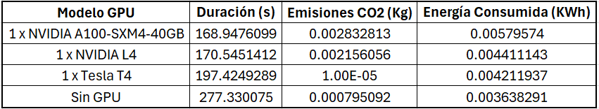
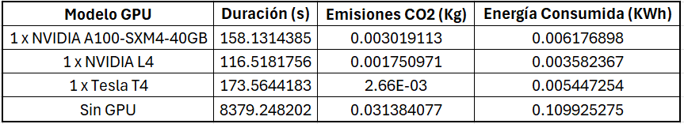
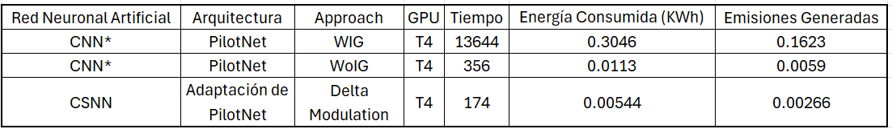

# CSNN_self_driving


**Keywords: Convolutional Spiking Neural Networks (CSNN), Self-driving, Sustainable Neural Network Training**

Los avances en Inteligencia Artificial y Machine Learning están transformando diversos sectores de la economía, incluido el transporte, particularmente en la conducción autónoma. No obstante, el elevado consumo de energía requerido para el entrenamiento y procesamiento de muchos de estos algoritmos plantea desafíos significativos, especialmente en el contexto del calentamiento global y la sostenibilidad ambiental. Una posible solución radica en adoptar un enfoque biológicamente plausible inspirado en el cerebro, mediante el uso de Redes Neuronales de Impulsos (SNNs, por sus siglas en inglés), que ofrecen un consumo energético más eficiente y la capacidad de aprovechar la dimensión temporal, entre otros beneficios.

Este trabajo presenta el entrenamiento de una Red Neuronal Convolucional de Impulsos (CSNN, por sus siglas en inglés) utilizando técnicas de aprendizaje profundo para la conducción autónoma de vehículos, mientras se mide la ecoeficiencia del proceso de entrenamiento. Para ello, se emplean scripts de Python, las librerías snnTorch y CodeCarbon, entre otras, así como el simulador de conducción autónoma de Udacity. Se transforman los datos de conducción convencional en un formato compatible con CSNN mediante modulación delta, y se compara el rendimiento y la sostenibilidad de la CSNN con una CNN convencional.

Los resultados obtenidos contribuirán al conocimiento sobre la aplicación de SNNs en la conducción autónoma y su potencial para reducir el impacto ambiental de los algoritmos de aprendizaje profundo. 

# Contenido

1. Diagrama del proyecto
2. Recursos
3. Objetivo
4. Condificando datos convenicionales en impulsos con modulación Delta con la librería snnTorch
5. Implementando y entrenando la CSNN (adaptación de PilotNet)
6. Midiendo la Ecoeficiencia del entrenamiento
7. Conectando el modelo con el simulador de Udacity
8. Resultados

## 1. Diagrama del proyecto

A continuación, se presenta un diagrama general del proyecto:


## 2. Recursos

El conjunto de imágenes que se utilizan como insumo para el proyecto, así como el conjunto de datos codificado en impulsos (Spikes) se almacenan en [Google Drive](https://drive.google.com) en formato [HDF5](https://docs.h5py.org/en/stable/index.html).

Este proyecto utiliza scripts de [Python](https://www.python.org/) que corren sobre [Google Colab](https://colab.research.google.com/) y para probar el modelo obtenido se realiza una conexión local con el simulador de conducción autónoma de [Udacity](https://github.com/udacity/self-driving-car-sim) creando un entorno de ejecución virtual utilizando el Prompt de [Anaconda](https://www.anaconda.com/).

La implementación de las redes neuronales de impulsos (SNNs) y particularmente de las CSNNs se realiza con la librería snnTorch [snnTorch](https://snntorch.readthedocs.io/en/latest/index.html#), en GitHub se encuentra disponible en este [enlace](https://github.com/jeshraghian/snntorch). El contenido publicado por los autores y su trabajo ha sido fundamental en este proyecto.

La arquitectura de la CSNNs corresponde a una adaptación de [PilotNet](https://github.com/lhzlhz/PilotNet).

La ecoeficiencia del proceso (energía consumida y emisiones generadas) se mide haciendo uso de la librería [CodeCarbon](https://codecarbon.io/).

[ChatGPT](https://chatgpt.com/) se utilizó como asistente en la generación de código con ejemplos, optimización, refactorización y depuración.

Por otra parte, también es importante mencionar el artículo que sirve como referencia e inspiración para este trabajo:  Martínez, F. S., Parada, R., & Casas-Roma, J. (2023). CO2 impact on convolutional network model training for autonomous driving through behavioral cloning. Advanced Engineering Informatics, 56, 101968. [https://doi.org/10.1016/j.aei.2023.101968](https://doi.org/10.1016/j.aei.2023.101968) 

## 3. Objetivo

Entrenar una red Red Neuronal Convolucional de Impulsos (CSNN) transformando un conjunto de datos convencionales de conducción autónoma y comparar los resultados en términos de rendimiento y sostenibilidad ambiental con los obtenidos en el entrenamiento de una Red Neuronal Convolucional (CNN) con el mismo conjunto de datos.

## 4. Condificando datos convenicionales en impulsos con modulación Delta con la librería snnTorch

El archivo *Optimization_Encode_Spikes_v12.ipynb* contiene el código por medio del cual se cargan, preprocesan, transforman, aumentan y codifican las imágenes en impulsos. Básicamente se cargan los datos generados por el simulador de Udacity en Google Drive y desde allí se utilizan como insumo. Al finalizar el proceso, en Google Drive se cargan dos archivos, que corresponden a los  datos de entrenamiento y validación codificados en impulsos y que se guardan en formato hdf5.

## 5. Implementando y entrenando la CSNN (adaptación de PilotNet)

El archivo *Optimization train CSNN v13.ipynb* contiene el código por medio del cual se define la arquitectura adaptada de PilotNet para construir la CSNN. Se adapta en varios aspectos, el primero es el uso de neuronas con modelo Leaky Integrate-and-Fire (LIF), el segundo es la eliminación de una capa convolucional, dejando cuatro capas convolucionales y cuatro capas completamente conectadas y finalmente la salida corresponde a 21 neuronas que codifican el valor del ángulo de giro del volante entre -1 y 1 en 21 pasos, es decir, la activación de la neurona 0 corresponde al ángulo -1, la activación de la neurona 10 al ángulo 0 y la activación de la neurona 20 al ángulo 1, con los posibles pasos intermedios entre estos valores.

Es importante mencionar que en la búsqueda de mejores resultados hay una sección para ajuste de hiperparámetros, esta sección luce de la siguiente forma:

```
# Sección de Hiperparámetros
class Config:
    batch_size = 256
    learning_rate = 0.001
    num_epochs = 200
    beta = 0.9  # Parámetro de decaimiento para las capas LIF
    patience = 10  # Parámetro de paciencia para EarlyStopping
    min_delta = 0.001  # Parámetro de cambio mínimo para EarlyStopping
```

Una vez el entrenamiento finaliza, el mejor modelo obtenido se guarda en formato ".pth". Dos ejemplos de estos modelos con diferentes hiperparámetros corresponden a:

best_model_20240618_071017_32_lr-3.pth --> Mejor modelo obtenido con batch size de 32, learning rate de 0.001 y 50 épocas

best_model_20240618_075633_256_lr-3_200ep.pth --> Mejor modelo obtenido con batch size de 256, learning rate de 0.001 y 200 épocas


## 6. Midiendo la Ecoeficiencia del entrenamiento

La librería CodeCarbon se integra con el proyecto a través de pocas líneas de código y permite estimar la cantidad de dióxido de carbono (CO2) producido por los recursos informáticos personales o en la nube utilizados para ejecutar el código.

```
tracker = EmissionsTracker(output_dir='/ubicacion_para_guardar_archivo_seguimiento', project_name=f"emissions_train_time}.csv")
tracker.start()
...Código a ejecutar
tracker.stop()
```

Y el resultado es un archivo csv con la información de la energía consumida y las emisiones generadas entre otros.

## 7. Conectando el modelo con el simulador de Udacity

El mejor modelo obtenido se prueba en el simulador de Udacity. Para ello se cuenta con el script de Python llamado "CSNN_drive_v13.py", que se corre localmente en un entorno virtual con los requerimientos que se encuentran en el archivo "requirements.txt".

Este script realiza varias tareas, primero configura la arquitectura de la CSNN con adaptación de PilotNet, los pesos y sesgos de esta red se cargan desde el archivo del mejor modelo obtenido. Por otra parte, toma las imágenes provenientes del simulador, las agrupa en parejas y les aplica la modulación delta de la librería snntorch, para convertirlas en impulsos. Esta representacion en impulsos se pasa al modelo, que gnera un ángulo de giro del volante como salida codificado en 21 posiciones, por lo que convierte este formato en un valor entre -1 y 1 para ser enviado al simulador. 

El script también controla la velocidad mínima y máxima del vehículo. Y finalmente establece los parámetros de configuración de red para conectarse con el simulador de Udacity en la que el paquete [Flask](https://flask.palletsprojects.com/en/3.0.x/) juega un papel muy importante, ya que hace las veces de servidor web que maneja la comunicación entre el simulador de conducción y el modelo de red neuronal convolucional de impulsos (CSNN). La biblioteca Flask, junto con SocketIO y Eventlet, se emplea para recibir datos de telemetría del simulador y enviar comandos de control en tiempo real.

Estas son algunas de las características de Flask en el script:

Servidor Web: Flask se utiliza para crear un servidor web ligero que puede recibir y procesar solicitudes HTTP. En este contexto, se utiliza junto con SocketIO para manejar la comunicación bidireccional en tiempo real entre el simulador y el servidor.

Manejo de Telemetría: Flask recibe los datos de telemetría enviados por el simulador, que incluyen la imagen de la cámara frontal del coche y la velocidad actual del vehículo. Estos datos son necesarios para que el modelo pueda predecir el ángulo de dirección adecuado.

Interacción en Tiempo Real: Flask, combinado con SocketIO, permite el manejo de eventos en tiempo real. Esto significa que el servidor puede recibir continuamente datos de telemetría, procesarlos y enviar comandos de control de vuelta al simulador de manera rápida y eficiente.

Integración con SocketIO: SocketIO extiende las capacidades de Flask al permitir comunicaciones basadas en eventos. Esto es crucial para aplicaciones en tiempo real como el control de un coche autónomo, donde los datos y comandos deben intercambiarse sin retrasos significativos.

En esta parte del proyecto resultó de mucha utilidad el material disponible en este [repositorio](https://github.com/entbappy/Complete-Self-Driving-Car) de "entbappy".

## 8. Resultados

Se realizaron las mediciones de ecoeficiencia de la codificación de imágenes en impulsos y del entrenamiento de la CSNN. 

La siguiente figura, presenta los resultados de la medición para el proceso de codificación de imágenes con diferentes entornos de ejecución:



El menor nivel de emisiones generadas se consigue con la configuración de GPU T4 del entorno de Google Colab con una duración de 197 segundos.



La mejor configuración de entorno para el entranimiento se consigue con el modelo de GPU L4, con alrededor de 174 segundos de ejecución generando 0.00175 Kg de CO2 y consumiendo 0.00358 de KWh.

La siguiente tabla presenta la comparación de estos resultados con los obtenidos en el artículo de referencia de: Martínez, F. S., Parada, R., & Casas-Roma, J. (2023). CO2 impact on convolutional network model training for autonomous driving through behavioral cloning. Advanced Engineering Informatics, 56, 101968. [https://doi.org/10.1016/j.aei.2023.101968](https://doi.org/10.1016/j.aei.2023.101968) 




